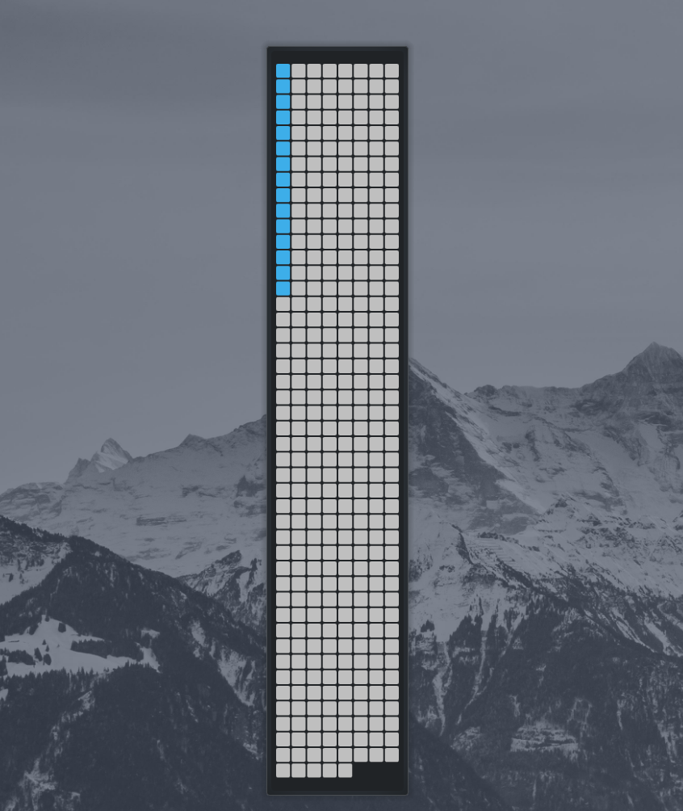
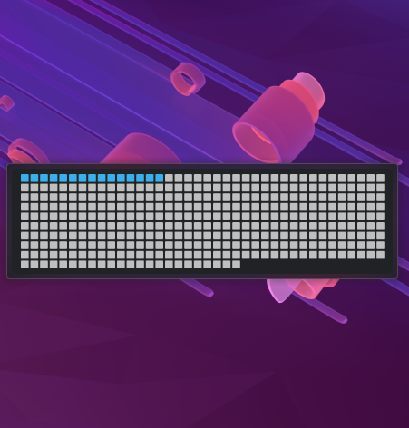
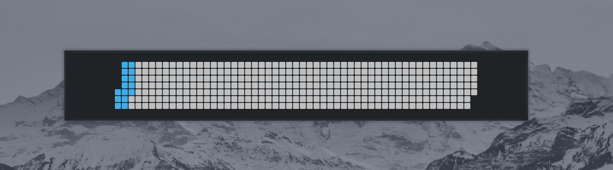

# Life Calendar Plasmoid

A simple year-progress visual calendar for KDE Plasma. Shows passed days of the year as squares in a grid.

---

## Disclaimer

Note that the plasmoid may experience significant lag when dragging (It's my first plasmoid SORRY! Contribute if you can!)

---

## Features / Modes

- **Horizontal / Vertical** layouts  
- **Vertical-heatmap** layout (week columns, 7 days per column)

<div style="display: flex; flex-wrap: wrap; gap: 0; overflow-x: auto;">
  
  
  
  
</div>


---

## Installation

1. Clone the repository:  
   ```bash
   git clone https://github.com/x2d7/lifecalendar-plasmoid.git
   ```
2. Copy to Plasma widgets folder:  
   ```bash
   cp -r lifecalendar-plasmoid ~/.local/share/plasma/plasmoids/
   ```
3. Add the plasmoid to your desktop from the **Add Widgets** menu.  

---

## Configuration

The plasmoid offers extensive customization options to fit your preferences:

### Layout & Size
- **orientation**: Layout mode (horizontal, vertical, vertical-heatmap)
- **maxSquare**: Maximum cell size in pixels

### Spacing & Appearance
- **gap**: Spacing between cells in pixels
- **backgroundRadius**: Corner radius of the widget background 

### Cell Styling
- **cellRadiusFactor**: Corner radius factor for cells
- **cellBorderWidth**: Border width for cells in pixels

### Update Settings
- **updateInterval**: How often to refresh the calendar (hourly, daily, weekly, monthly)

### Colors
- **useCustomColors**: Enable custom color scheme
- **filledColor**: Color for passed days
- **emptyColor**: Color for remaining days
- **todayBorderColor**: Color for today's border
- **backgroundColor**: Widget background color

When `useCustomColors` is disabled, colors automatically follow your Plasma theme.

---
